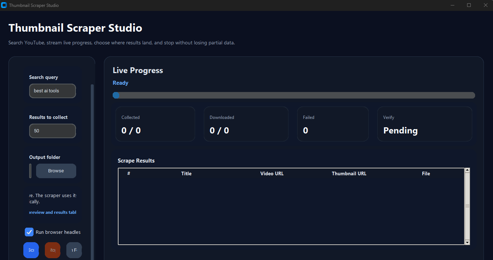
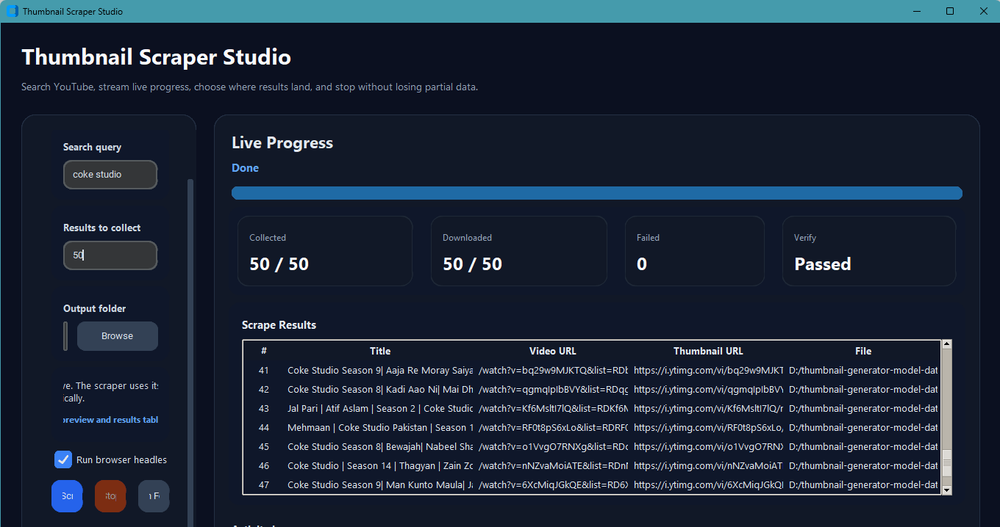

# Thumbnail Scraper Studio

A Windows desktop app that searches YouTube, collects video thumbnails, and exports everything to CSV — with a live browser preview and real-time progress tracking while it runs.



---

## Why this exists

The command-line scraper works fine for quick runs, but once you're collecting hundreds of thumbnails for a training dataset you want to actually *see* what's happening — which results are coming in, how many failed, whether the browser is stuck. This app adds a proper UI around the same scraping logic so you can monitor a run without staring at terminal output, and stop it mid-way without losing what's already been collected.

---

## Features

- Live browser preview so you can see the headless Chromium session as it scrapes
- Real-time counters for collected, downloaded, verified, and failed results
- Results table that populates during the run, not just at the end
- Stop button that saves partial data instead of throwing it away
- Output folder picker — choose where the CSV and thumbnails land
- Packages into a standalone `.exe` via PyInstaller, no Python install required on the target machine

---

## Requirements

- Python 3.12 or newer
- Playwright with Chromium
- Windows 10 or Windows 11

---

## Setup

```bash
python -m venv .venv
.venv\Scripts\activate
pip install -e .
playwright install chromium
```

---

## Run

```bash
python main.py
```

`main.py` is just the entry point — it imports and launches `app.py`. You can run either one directly.

Fill in the search query and result count in the left panel, pick an output folder, then hit **Start**. The browser preview and progress counters on the right update as the run proceeds. Hit **Stop** at any point to save what's been collected so far.

---

## Output

Everything goes into the folder you selected:

```
<your output folder>/
├── video_data.csv
└── thumbnails/
```

The CSV includes a header block with the original query and result count, then one row per video:

| Column | Description |
|---|---|
| index | Position in the search results |
| title | Video title |
| video_url | YouTube watch URL |
| thumbnail_url | Original CDN URL |
| thumbnail_file | Local path to the downloaded image |

Thumbnail filenames follow the pattern `{index}_{title_slug}.jpg`. If a thumbnail fails to download, the row is still written to the CSV with an empty file path.

---

## Build a standalone executable

```bash
pip install pyinstaller
pyinstaller ThumbnailScraper.spec
```

The output is `dist/ThumbnailScraper.exe`. The spec file includes a Playwright runtime hook that points the frozen app to the correct browser cache location (`%LOCALAPPDATA%\ms-playwright`) on Windows, so Chromium is found correctly without a Python environment.

---

## Project structure

```
.
├── main.py                    # Entry point
├── app.py                     # CustomTkinter UI
├── scraper.py                 # Scraping and download logic
├── playwright_runtime_hook.py # Browser path fix for packaged builds
├── ThumbnailScraper.spec      # PyInstaller build config
├── pyproject.toml
└── assets/
    ├── app-screenshot.png
    └── results-screen.png
```

---

## Notes

- The scraper runs a verification pass after collection to confirm the result count before downloading starts
- Download retries multiple thumbnail URL candidates per video to reduce failures on results with non-standard thumbnail formats
- Playwright browsers need to be installed once on any machine running the source version (`playwright install chromium`); the packaged `.exe` uses the existing Windows cache
- YouTube's page structure can change — if titles or thumbnails stop being collected, the selectors in `scraper.py` are the first place to check

---

## Result screen


